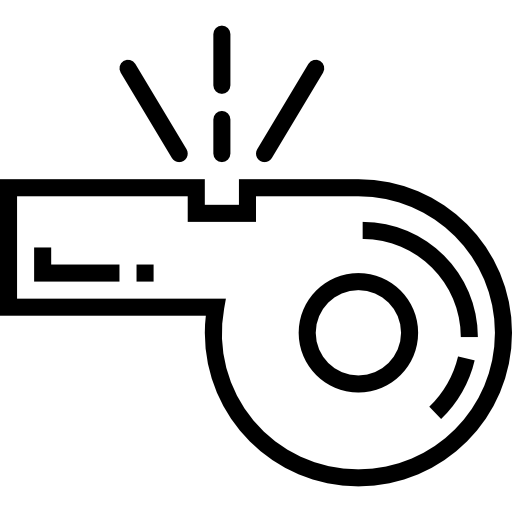

# Session Expired Modal UI

Welcome to my 'new day new design' journey!
This is Session Expired Modal UI, which is the 8th day's project of my journey.

Demo -> https://enesoeztekin.github.io/web-ui-design/Day-8

### Use in your project easily!

All you need to do:

1. Copy this code and paste it into the place you want to use in your HTML file.

```
<!-- Session Expired Modal Component -->
    <div class="component">
        
        <h2>Your session has expired.</h2>
        <p>Enter your password to pick up where you left off.</p>
        <label for="password">Password</label>
        <div>
            <input type="text" name="text" placeholder="Enter your password here">
            <button class="btn-resume">Resume</button>
        </div>
    </div>
<!-- Session Expired Modal Component -->
```

2. Copy the CSS code, and paste it in your CSS file connected to the HTML part.

```
.component {
  font-family: "Poppins", sans-serif;
  padding: 3rem;
  border-radius: 8px;
  box-shadow: 0px 4px 15px 2px rgba(184, 184, 184, 0.3);
  display: flex;
  justify-content: center;
  align-items: center;
}

.component img {
  width: 60px;
  transform: rotateY(180deg);
  margin-bottom: 1rem;
}

.component p {
  margin: 1rem 0;
  font-size: 0.75rem;
  font-weight: 300;
}

.component label {
  display: block;
}

.component input {
  border: 1px solid aliceblue;
  padding: 1rem;
  background-color: azure;
  border-radius: 5px;
}

.component input:focus {
  outline: 1px solid rgb(182, 182, 182);
}

.component .btn-resume {
  border: none;
  background-color: bisque;
  padding: 1rem 3rem;
  border-radius: 5px;
  cursor: pointer;
}

.component .btn-resume:hover {
  background-color: rgb(253, 207, 150);
}

@media (max-width: 500px) {
  .component .btn-resume {
    margin-top: 0.5rem;
    width: 100%;
  }
  .component input {
    width: 100%;
  }
}
```

Then, edit the text and buttons' function as you desire.

<strong>Preview (Mobile): </strong>


<strong>Preview (Desktop): </strong>


If you like this simple UI, please leave a star to my repo.
